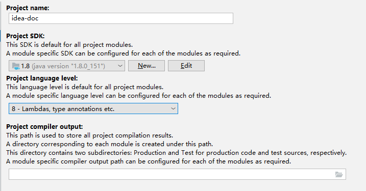

Eclipse用户设置（推荐）
=======================

File-\>Settings中，找到如图Keymap设置，修改模式为Eclipse，即可使用绝大多数Eclipse的快捷键，降低上手难度。原先使用Eclipse或MyEclipse用户的福音呀
\^_\^ 。

配置JDK
=======

点击菜单 File-\>Project Structure...，进入项目结构管理界面。

在Project
SDK中选择对应JDK，如没有检测到已安装的JDK，可以点击New…按钮并选择JDK选项，找到对应的JDK安装目录即可。

Project language
level级别选择对应的语言编译级别，比如jdk1.8建议选择8-Lambdas,type annotations
etc. 选项。

选择完成后，如图所示，点击OK保存生效。

配置Maven
=========

在Setting界面（Setting界面均指File-\>Setting菜单打开的界面）。搜索Maven，可快速找到配置项。如图所示位置，找到maven配置后，确认下maven版本和maven设置目录。Maven的设置文件setting.xml主要用于配置私服仓库地址。私服仓库一般公司都会有吧
\^_\^
。可直接找同事要这个maven配置文件setting.xml，避免繁琐的配置，但要注意setting.xml中的localRepository路径对应你本地的路径。（通俗的讲，localRepository路径表示你的maven项目jar包缓存路径吧）

