下载版本最新的IDEA版本，本文档使用的版本为ideaIU-2019.2，如图。

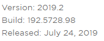

下载地址：<https://www.jetbrains.com/idea/download/#section=windows>

注意：请下载windows版本的Ultimate旗舰版哦 \^_\^

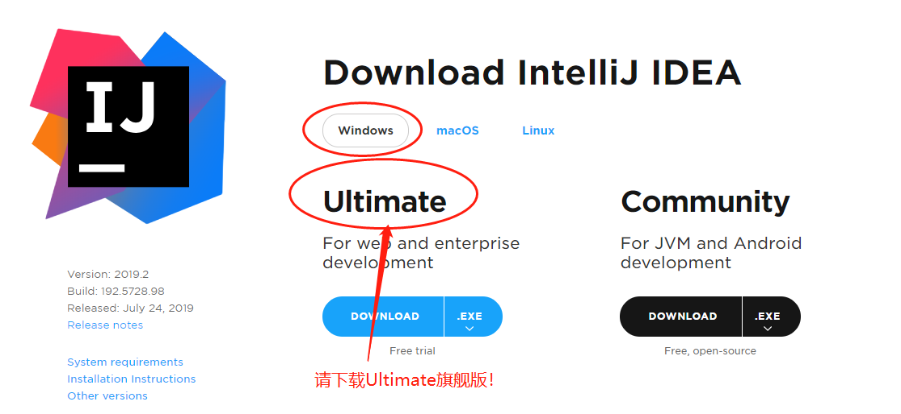

安装完IDEA后，双击桌面图标打开。

初次启动如果提示如图对话框，有老版本IDEA可选择第一项Previous
version导入老配置，也可以选择第三项Do not import settings，重新创建新配置文件。

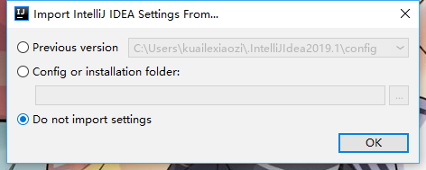

接下来会提示选择主题风格，可选择黑色风格和白色风格，按照喜好选择即可。点击Next下一步（主题也可以进入界面后，在setting中配置）

进入默认插件选择界面，保持默认即可。（默认选项满足大多数开发场景）。点击Next。

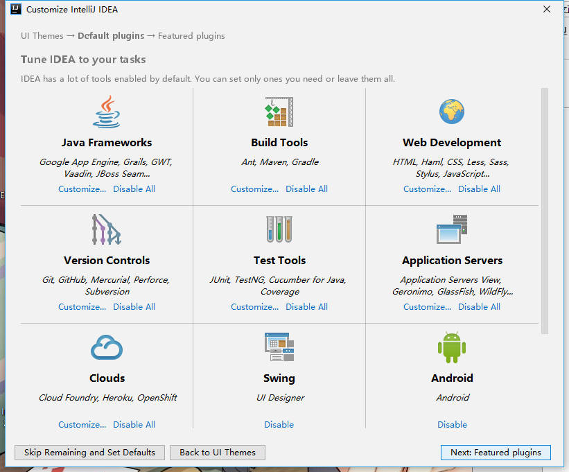

进入功能插件选择界面，依然保持默认选项，直接点击“Start using IntelliJ IDEA”。

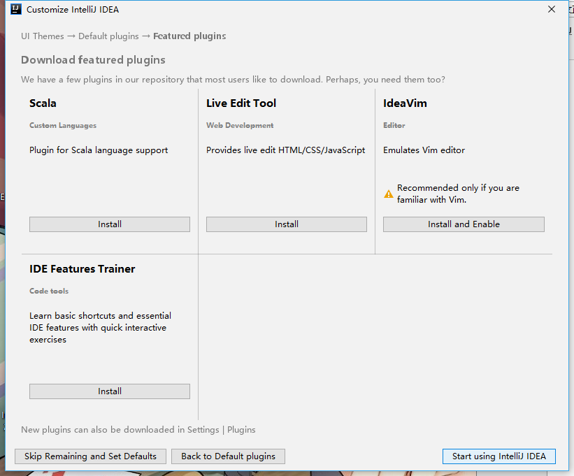

然后会进入激活窗口。旗舰版默认可试用1个月，试用结束后必须激活才能使用。

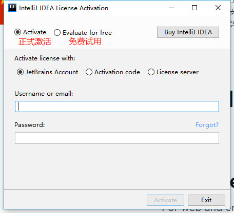

在Activation code选项下，填入百度搜到的激活码即可，百度搜索关键字“idea 2019.2
激活码”,注意与自己安装的版本一致。多尝试，总有成功的，good luck to you！

赠送一枚激活码，尽快使用哦！激活码（前后不要带空格哦！）：

T3ACKYHDVF-eyJsaWNlbnNlSWQiOiJUM0FDS1lIRFZGIiwibGljZW5zZWVOYW1lIjoi5bCP6bifIOeoi+W6j+WRmCIsImFzc2lnbmVlTmFtZSI6IiIsImFzc2lnbmVlRW1haWwiOiIiLCJsaWNlbnNlUmVzdHJpY3Rpb24iOiIiLCJjaGVja0NvbmN1cnJlbnRVc2UiOmZhbHNlLCJwcm9kdWN0cyI6W3siY29kZSI6IklJIiwiZmFsbGJhY2tEYXRlIjoiMjAxOS0wNi0xMyIsInBhaWRVcFRvIjoiMjAyMC0wNi0xMiJ9LHsiY29kZSI6IkFDIiwiZmFsbGJhY2tEYXRlIjoiMjAxOS0wNi0xMyIsInBhaWRVcFRvIjoiMjAyMC0wNi0xMiJ9LHsiY29kZSI6IkRQTiIsImZhbGxiYWNrRGF0ZSI6IjIwMTktMDYtMTMiLCJwYWlkVXBUbyI6IjIwMjAtMDYtMTIifSx7ImNvZGUiOiJQUyIsImZhbGxiYWNrRGF0ZSI6IjIwMTktMDYtMTMiLCJwYWlkVXBUbyI6IjIwMjAtMDYtMTIifSx7ImNvZGUiOiJHTyIsImZhbGxiYWNrRGF0ZSI6IjIwMTktMDYtMTMiLCJwYWlkVXBUbyI6IjIwMjAtMDYtMTIifSx7ImNvZGUiOiJETSIsImZhbGxiYWNrRGF0ZSI6IjIwMTktMDYtMTMiLCJwYWlkVXBUbyI6IjIwMjAtMDYtMTIifSx7ImNvZGUiOiJDTCIsImZhbGxiYWNrRGF0ZSI6IjIwMTktMDYtMTMiLCJwYWlkVXBUbyI6IjIwMjAtMDYtMTIifSx7ImNvZGUiOiJSUzAiLCJmYWxsYmFja0RhdGUiOiIyMDE5LTA2LTEzIiwicGFpZFVwVG8iOiIyMDIwLTA2LTEyIn0seyJjb2RlIjoiUkMiLCJmYWxsYmFja0RhdGUiOiIyMDE5LTA2LTEzIiwicGFpZFVwVG8iOiIyMDIwLTA2LTEyIn0seyJjb2RlIjoiUkQiLCJmYWxsYmFja0RhdGUiOiIyMDE5LTA2LTEzIiwicGFpZFVwVG8iOiIyMDIwLTA2LTEyIn0seyJjb2RlIjoiUEMiLCJmYWxsYmFja0RhdGUiOiIyMDE5LTA2LTEzIiwicGFpZFVwVG8iOiIyMDIwLTA2LTEyIn0seyJjb2RlIjoiUk0iLCJmYWxsYmFja0RhdGUiOiIyMDE5LTA2LTEzIiwicGFpZFVwVG8iOiIyMDIwLTA2LTEyIn0seyJjb2RlIjoiV1MiLCJmYWxsYmFja0RhdGUiOiIyMDE5LTA2LTEzIiwicGFpZFVwVG8iOiIyMDIwLTA2LTEyIn0seyJjb2RlIjoiREIiLCJmYWxsYmFja0RhdGUiOiIyMDE5LTA2LTEzIiwicGFpZFVwVG8iOiIyMDIwLTA2LTEyIn0seyJjb2RlIjoiREMiLCJmYWxsYmFja0RhdGUiOiIyMDE5LTA2LTEzIiwicGFpZFVwVG8iOiIyMDIwLTA2LTEyIn0seyJjb2RlIjoiUlNVIiwiZmFsbGJhY2tEYXRlIjoiMjAxOS0wNi0xMyIsInBhaWRVcFRvIjoiMjAyMC0wNi0xMiJ9XSwiaGFzaCI6IjEzMzgwMDA0LzAiLCJncmFjZVBlcmlvZERheXMiOjcsImF1dG9Qcm9sb25nYXRlZCI6ZmFsc2UsImlzQXV0b1Byb2xvbmdhdGVkIjpmYWxzZX0=-nTBuZDiAOuM4IHXNkS7GbCvZVZFo4EcHf9hHzfhaPYsaCGQjuCVJFEboopbPuEHn16yT9Zvf7yRuM5WGlGmpcOJnWLpCmGm65S6wHtZdX0kfSNIqnqdS1MhIHpftsAGxSswuQksrm09tltbO4nATeavGs1BIMafsCJVen+BvDFvYL7+3crkRI7AwdyMb2miLLYJcEVPhiVKZnzJUzT9uA8/4Q02BqsvX5oSJg8cLw3w7Cd0ISrn1i8uENe/1z3T/Ede0STM7eOekFaVEdO9cgzYME3iIFzi2TZXMSqIuBpJqF4NFb6M0039tEGy6EHqcksMyDTdCAASquqcDcHrUUA==-MIIElTCCAn2gAwIBAgIBCTANBgkqhkiG9w0BAQsFADAYMRYwFAYDVQQDDA1KZXRQcm9maWxlIENBMB4XDTE4MTEwMTEyMjk0NloXDTIwMTEwMjEyMjk0NlowaDELMAkGA1UEBhMCQ1oxDjAMBgNVBAgMBU51c2xlMQ8wDQYDVQQHDAZQcmFndWUxGTAXBgNVBAoMEEpldEJyYWlucyBzLnIuby4xHTAbBgNVBAMMFHByb2QzeS1mcm9tLTIwMTgxMTAxMIIBIjANBgkqhkiG9w0BAQEFAAOCAQ8AMIIBCgKCAQEAxcQkq+zdxlR2mmRYBPzGbUNdMN6OaXiXzxIWtMEkrJMO/5oUfQJbLLuMSMK0QHFmaI37WShyxZcfRCidwXjot4zmNBKnlyHodDij/78TmVqFl8nOeD5+07B8VEaIu7c3E1N+e1doC6wht4I4+IEmtsPAdoaj5WCQVQbrI8KeT8M9VcBIWX7fD0fhexfg3ZRt0xqwMcXGNp3DdJHiO0rCdU+Itv7EmtnSVq9jBG1usMSFvMowR25mju2JcPFp1+I4ZI+FqgR8gyG8oiNDyNEoAbsR3lOpI7grUYSvkB/xVy/VoklPCK2h0f0GJxFjnye8NT1PAywoyl7RmiAVRE/EKwIDAQABo4GZMIGWMAkGA1UdEwQCMAAwHQYDVR0OBBYEFGEpG9oZGcfLMGNBkY7SgHiMGgTcMEgGA1UdIwRBMD+AFKOetkhnQhI2Qb1t4Lm0oFKLl/GzoRykGjAYMRYwFAYDVQQDDA1KZXRQcm9maWxlIENBggkA0myxg7KDeeEwEwYDVR0lBAwwCgYIKwYBBQUHAwEwCwYDVR0PBAQDAgWgMA0GCSqGSIb3DQEBCwUAA4ICAQAF8uc+YJOHHwOFcPzmbjcxNDuGoOUIP+2h1R75Lecswb7ru2LWWSUMtXVKQzChLNPn/72W0k+oI056tgiwuG7M49LXp4zQVlQnFmWU1wwGvVhq5R63Rpjx1zjGUhcXgayu7+9zMUW596Lbomsg8qVve6euqsrFicYkIIuUu4zYPndJwfe0YkS5nY72SHnNdbPhEnN8wcB2Kz+OIG0lih3yz5EqFhld03bGp222ZQCIghCTVL6QBNadGsiN/lWLl4JdR3lJkZzlpFdiHijoVRdWeSWqM4y0t23c92HXKrgppoSV18XMxrWVdoSM3nuMHwxGhFyde05OdDtLpCv+jlWf5REAHHA201pAU6bJSZINyHDUTB+Beo28rRXSwSh3OUIvYwKNVeoBY+KwOJ7WnuTCUq1meE6GkKc4D/cXmgpOyW/1SmBz3XjVIi/zprZ0zf3qH5mkphtg6ksjKgKjmx1cXfZAAX6wcDBNaCL+Ortep1Dh8xDUbqbBVNBL4jbiL3i3xsfNiyJgaZ5sX7i8tmStEpLbPwvHcByuf59qJhV/bZOl8KqJBETCDJcY6O2aqhTUy+9x93ThKs1GKrRPePrWPluud7ttlgtRveit/pcBrnQcXOl1rHq7ByB8CFAxNotRUYL9IF5n3wJOgkPojMy6jetQA5Ogc8Sm7RG6vg1yow==

激活成功后，进入欢迎窗口，Welcome to IntelliJ IDEA。 \^_\^

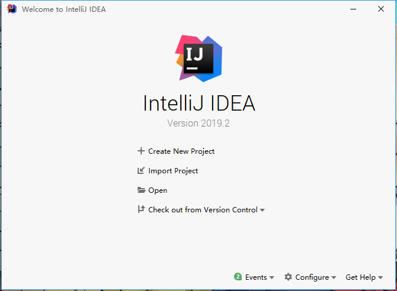

现在可以创建一个新项目（Create New Project）了，点击“Create New Project”。

注：强调一下，Eclipse中的工作空间workspace与IDEA中的Project是相似的。

| IDEA    | Eclipse   |
|---------|-----------|
| Project | WorkSpace |
| Module  | Project   |
|         |           |

为了方便管理，建议一个Project中，只创建一个Module。

进入创建项目窗口，选择空项目Empty Project。

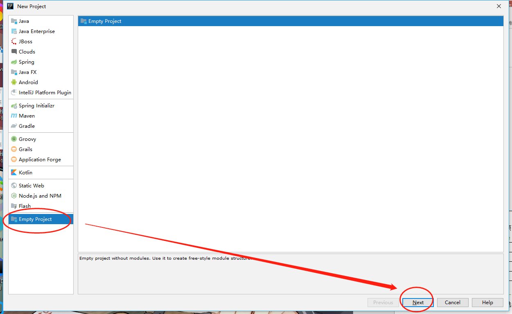

根据实际情况，填写项目名称和目录位置，如图。

本示例中项目名（Project name）填写Project01，项目路径（Project
location）填写C:\\IdeaProjects\\Project01

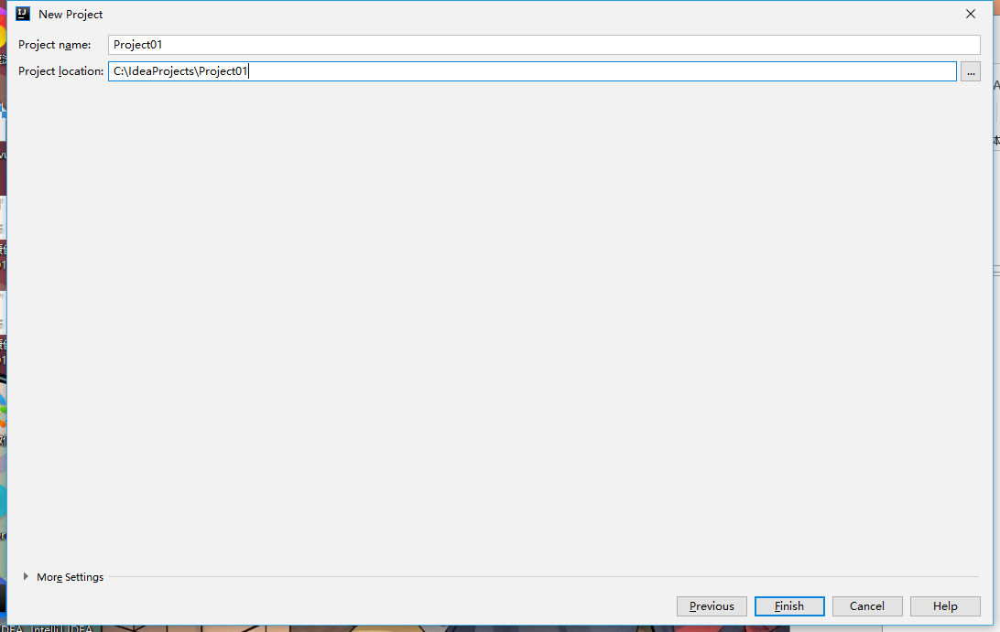

点击Finish完成。如提示目录不存在，选择OK即可。

稍等片刻，终于看到主界面了。

注意：留意看右下角的进度，如果显示 process running…
字样，说明正在创建索引，电脑卡顿一会儿，很正常，耐心等待一下呦！

在默认弹出的项目结构弹框中（也可以从菜单进入，File-\>Project Structure…），如图

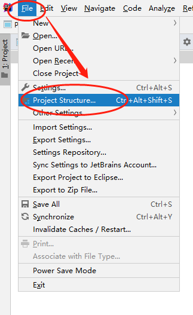

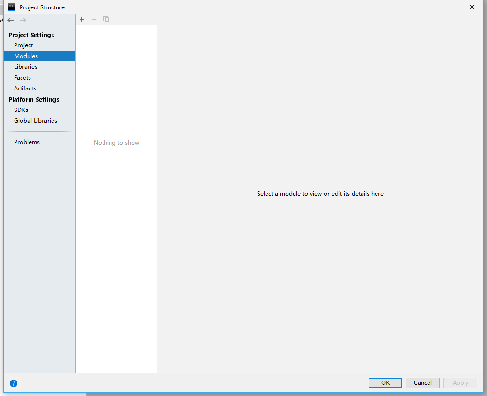

这里可以设置jdk和导入项目操作，预知后事如何，请听下回分解！\^_\^
